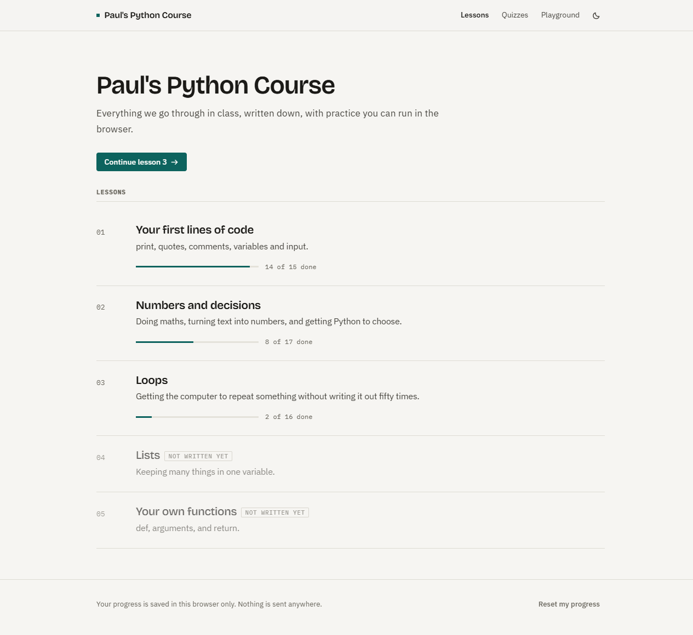
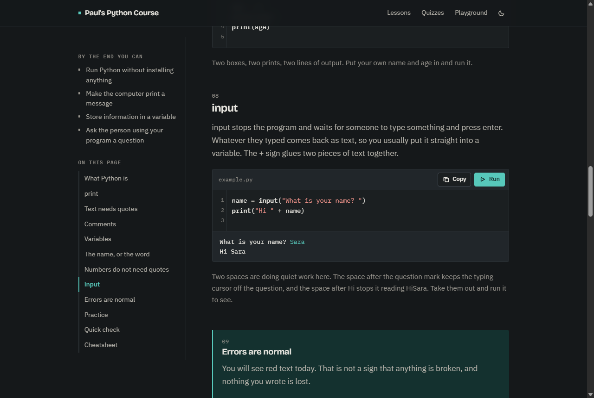
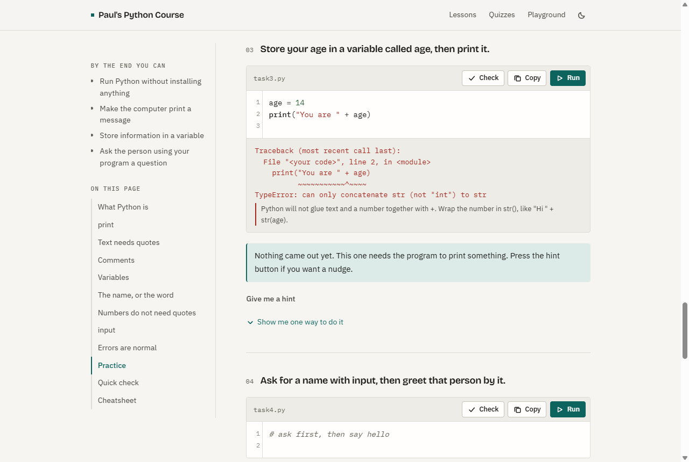
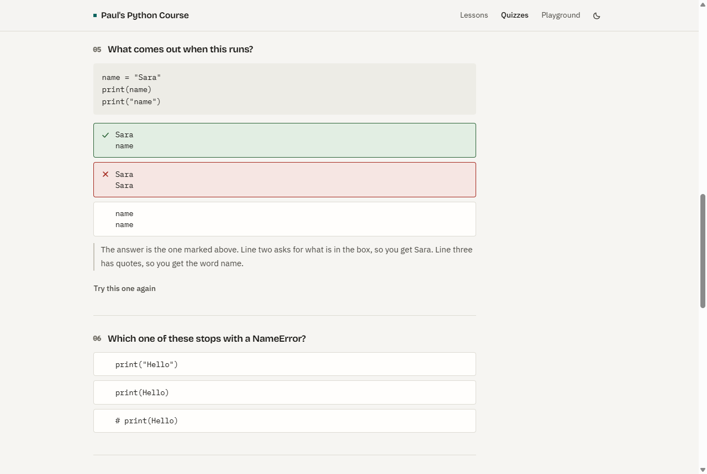
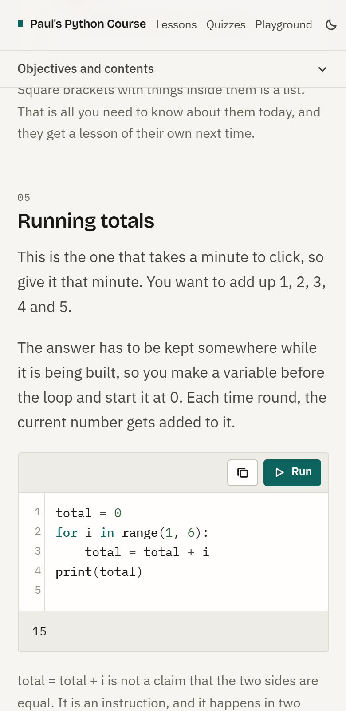

# Paul's Python Course

[](https://bouwles.github.io/pauls-python-course/)
[](#)
[](LICENSE)
[](https://github.com/Bouwles/pauls-python-course/commits)


A revision site for the teenagers I teach Python to in person. After each
lesson they come here to re-read what we covered, try the practice, and run
Python in the browser without installing anything.

**Live: <https://bouwles.github.io/pauls-python-course/>**

Plain HTML, CSS and vanilla JavaScript. No React, no build step, no bundler, no
`npm install`, no backend, no tracking. Clone it and open `index.html`.

---

## What it looks like

**Home — every lesson, with how far through you are**



**Lesson page — editable examples that actually run, including `input()`**

Python runs client side via Pyodide. `input()` opens an inline prompt in the
output area rather than a browser dialog, so a program can stop and wait for an
answer without freezing the page.



**Practice — errors explained in English, and checks that never say "wrong"**

Every traceback keeps its real line number and gets a plain-English line
underneath it. Failed checks say what was expected and offer a hint.



**Quizzes — recall, predict-the-output, and type-the-code**



**On a phone, because that is what my students actually use**



---

## What is in it

- **Lessons** rendered entirely from one data file, with a sticky sidebar of
  objectives and a contents list that follows you down the page.
- **Runnable code blocks.** Every example is editable and has Run and Copy.
  Pyodide loads lazily on the first Run and says so while it boots.
- **`input()` support** with an inline prompt, so programs that ask questions
  work like they do on a real machine.
- **Error translations.** SyntaxError, NameError, `str + int` and a dozen more
  get a sentence of plain English. The table is its own file, easy to extend.
- **Practice tasks** with five kinds of gentle check, a hint button, and a
  worked answer that stays hidden until they have had a go themselves.
- **Quizzes** on their own page: multiple choice, predict-the-output, and
  type-the-line. No score — at the end it lists the sections behind whatever
  they got wrong first time, as links back into the lesson.
- **Playground** for messing about, with the code kept between visits.
- **Progress** in `localStorage` only. Nothing is sent anywhere, there are no
  accounts, no cookie banner and no analytics.
- **Light and dark themes**, both designed properly, following the system
  setting with a manual toggle.
- Keyboard usable throughout, real focus rings, AA contrast in both themes.

---

## Running it locally

Double-click `index.html`. That is genuinely it — Pyodide and CodeMirror come
from their CDNs and work fine from `file://`.

If you would rather serve it over `http://`, which is closer to how GitHub
Pages behaves:

```bash
python -m http.server 8000
```

Then open <http://localhost:8000>.

---

## Adding Lesson 2

Everything a lesson contains lives in **`data/lessons.js`**. That is the only
file you edit.

1. Open `data/lessons.js`.
2. Copy the whole Lesson 1 object (from `{ id: 1,` down to its closing `},`)
   and paste it below itself, inside the same `window.LESSONS = [ ... ]` array.
3. Change `id` to `2`, give it a new `slug`, `title`, `summary`, and rewrite
   the contents.
4. Scroll to `window.UPCOMING` at the bottom and delete the `{ id: 2, ... }`
   entry, so it stops showing as a locked card.
5. Save, refresh the browser. The lesson appears on the home page, at
   `lesson.html?id=2`, and its quiz at `quiz.html?id=2`.

Nothing else needs touching. No HTML, no CSS, no JavaScript.

### What goes in a lesson object

```js
{
  id: 2,
  slug: "numbers-and-decisions",
  title: "Numbers and decisions",
  summary: "One line, shown on the lesson card.",
  objectives: ["Shown in the sidebar", "Keep them short"],
  sections: [ ... ],      // see below
  practice: [ ... ],      // see below
  quiz: [ ... ],          // see below
  cheatsheet: [ { code: "int(x)", meaning: "turn text into a number" } ],
  next: "Teaser line for the lesson after this one."
}
```

### Section types

Each one becomes a numbered section with its own entry in the sidebar contents.

```js
{ type: "text",    heading: "...", body: "one string, or an array of paragraphs" }

{ type: "code",    heading: "...", body: "...",
                   code: 'print("Hello")\n',
                   explain: "shown under the editor",
                   runnable: true }        // false renders it read-only

{ type: "callout", heading: "...", body: "..." }   // tinted, accent rule

{ type: "mistake", heading: "...", body: "...",
                   wrong: 'print(Hello)',
                   right: 'print("Hello")',
                   why: "the explanation" }
```

### Practice tasks

```js
{
  id: "p1",                        // unique inside this lesson, used by progress
  prompt: "Print your own name.",
  starter: "# type your code here\n",
  hint: "Shown when they press the hint button.",
  solution: 'print("Paul")\n',     // hidden until they have pressed Run once
  check: { type: "output-not-empty" }
}
```

| check type | what it does |
|---|---|
| `output-not-empty` | passes if the program printed anything |
| `output-contains` | `value` is a string or an array of strings, all must appear in the output (case-insensitive) |
| `output-matches` | `value` is a regex (or a regex string plus optional `flags`) tested against the output |
| `code-contains` | same as `output-contains` but tested against the code they wrote |
| `custom` | `fn({ code, output })` returns true or false |

Any check can carry a `message`, the friendly sentence shown when it does not
pass. Give `check` an **array** if you need more than one, and all must pass:

```js
check: [
  { type: "code-contains", value: "age =", message: "I could not find a variable called age." },
  { type: "output-not-empty" }
]
```

### Quiz questions

These render on `quiz.html?id=<lesson>`, not on the lesson page. Three types.

`choice` is the default, so `type` can be left off. `answer` is the index of
the right option, counting from 0. `review` is the index of the section worth
re-reading if they get it wrong, and it drives the list shown at the end.

```js
{
  question: "What does # do?",
  options: ["Runs the line twice", "Makes Python ignore the rest of the line"],
  answer: 1,
  explain: "Everything after # is skipped.",
  review: 3                      // -> section 4 in the lesson, 0-indexed
}
```

Add `optionsAreCode: true` when the options are snippets rather than sentences,
and they will be set in the monospace face.

`predict` shows a code sample and asks what comes out. The options are output,
so they are always set as code and can contain newlines.

```js
{
  type: "predict",
  question: "What comes out when this runs?",
  code: '# print("one")\nprint("two")\n',
  options: ["two", "one\ntwo", "one"],
  answer: 0,
  explain: "The first line is commented out.",
  review: 3
}
```

`write` asks them to type a line of Python. `accept` is a list of answers that
count as right; the first is shown if they get it wrong. Matching forgives
spacing and swaps single quotes for double, and nothing else, so `Print` is
still wrong.

```js
{
  type: "write",
  question: "Write the line that shows the word Hello on the screen.",
  placeholder: "one line of Python",
  accept: ['print("Hello")'],
  explain: "print, then brackets, then the text inside quotes.",
  review: 1
}
```

There is no score. When every question has been answered once, the quiz lists
the sections behind the ones they got wrong on the first attempt, as links back
into the lesson.

---

## Extending the error explanations

When a student's code errors, the red traceback gets a plain-English line
underneath it. That table is `assets/js/errors.js`. Add an entry:

```js
{ test: /SomeError: the exact text/i, hint: "What it usually means." }
```

First match wins, so put specific patterns above general ones. `hint` can also
be a function receiving the regex match, if you want to quote part of the error
back to them.

---

## Deploying

Every push to `main` publishes the site through GitHub Actions. There is no
build step — the workflow uploads the repo as-is.

```bash
git add -A
git commit -m "Add lesson 2"
git push
```

Then watch the run under the **Actions** tab. It takes about a minute.

If you fork this, go to **Settings → Pages → Build and deployment** and set
**Source** to **GitHub Actions**. Nothing else to configure.

---

## File map

```
index.html            home page: lesson list and progress
lesson.html           renders one lesson from ?id=
quiz.html             all quizzes, or one quiz with ?id=
playground.html       blank editor
404.html
data/lessons.js       ALL lesson content - the only file you edit to add lessons
assets/css/site.css   the whole design, both themes
assets/js/store.js    progress in localStorage, theme, small DOM helpers
assets/js/errors.js   plain-English error translations
assets/js/runner.js   Pyodide loading, input() handling, the editor widget
assets/js/lesson.js   builds the lesson page
assets/js/quiz.js     builds the quiz index and the quizzes
assets/js/home.js     builds the home page
assets/js/playground.js
screenshots/          the images in this README
.github/workflows/deploy.yml
```

---

## Things worth knowing

- **Python** is [Pyodide](https://pyodide.org), loaded from jsDelivr the first
  time anyone presses Run. It is a few megabytes, so the first run takes a few
  seconds and says so. After that it is instant for the rest of the visit.
- **The editor** is [CodeMirror 5](https://codemirror.net/5/) from cdnjs, which
  works as plain script tags. CodeMirror 6 would need a bundler, and the whole
  point here is that there is no build step. If either CDN is unreachable the
  editors fall back to plain textareas.
- **`input()`** works because the code is rewritten before it runs: `input(...)`
  becomes an awaited call, and any function that ends up containing an await
  becomes an `async def` along with the calls to it. The tree is compiled
  directly rather than unparsed, so traceback line numbers still match what was
  typed. Beginner code is fine; `input()` inside a lambda or a comprehension is
  not.
- **There is no Stop button.** Interrupting a running program needs
  `SharedArrayBuffer` and cross-origin isolation headers, which GitHub Pages
  cannot send, so an infinite loop freezes the tab until it is refreshed.
- **Progress** is `localStorage` under `ppc:progress:v1`. It never leaves the
  device, so the same student on a school computer and on their phone will see
  different progress. The reset button is in the footer.

---

## Licence

Do what you like with the code. The lesson writing is mine.
